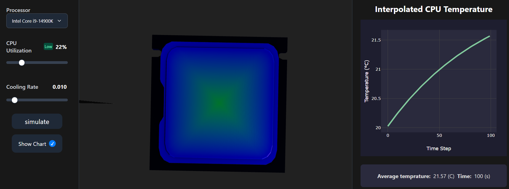

# CPU Thermal Simulator

  

A real-time tool for modeling and visualizing the thermal behavior of a CPU. This simulator provides a 3D heatmap to illustrate heat dissipation, making it perfect for students, researchers, and PC enthusiasts.

---

## 🌟 Key Features

- **Real-time 3D Heatmap:** Visualize temperature distribution across the CPU with an interactive 3D model.
- **Live Simulation:** Watch the thermal map change instantly as the simulation runs.
- **Adjustable Workload:** Use a simple slider to increase or decrease the CPU stress and see the impact.
- **Separate Frontend & Backend:** A modern architecture using a Python backend for simulation and a JavaScript frontend for a rich user experience.
- **Data Export:** (Optional feature) Export simulation data to CSV for further analysis.

---

## 📸 Screenshots & Demos




---

## 🛠️ Tech Stack

- **Backend:** Python, FastAPI
- **Frontend:** JavaScript, Node.js, React
- **Database:** (Optional, if you use one) e.g., SQLite, PostgreSQL

---

## 🚀 Getting Started

To get a local copy up and running, please follow these steps.

### Prerequisites

- Python 3.8+
- Node.js v14+ and npm
- Git

### Project Structure

The project is organized into two main directories:

your-repository/
├── backend/ # Contains the Python FastAPI simulation server
└── frontend/ # Contains the JavaScript frontend application

### Installation & Setup

You will need **two separate terminals** to run the backend and frontend servers simultaneously.

**Terminal 1: Backend Setup**

1.  Clone the repository:
    ```sh
    git clone https://github.com/your-username/your-repository.git
    cd your-repository/backend
    ```
2.  Install Python dependencies:
    ```sh
    pip install -r requirements.txt
    ```
3.  Run the backend server:
    ```sh
    uvicorn app:app --reload
    ```
    The backend should now be running on `http://127.0.0.1:8000`.

**Terminal 2: Frontend Setup**

1.  Navigate to the frontend directory:
    ```sh
    cd your-repository/frontend
    ```
2.  Install Node.js dependencies:
    ```sh
    npm install
    ```
3.  Run the frontend development server:
    ```sh
    npm run dev
    ```
    The application should now be accessible in your browser at `http://localhost:3000` (or another port specified in the output).

---

## 🕹️ How to Use

Once the application is running:

1.  Open your web browser to the frontend URL (e.g., `http://localhost:3000`).
2.  Use the slider to set the desired CPU workload.
3.  Click "Start Simulation" to begin.
4.  Observe the temperature data and the interactive 3D heatmap to visualize the CPU's thermal performance in real-time.

---

## 🤝 Contributing

Contributions are what make the open-source community such an amazing place to learn, inspire, and create. Any contributions you make are **greatly appreciated**.

If you have a suggestion that would make this project better, please fork the repo and create a pull request. You can also simply open an issue with the tag "enhancement".

1.  Fork the Project
2.  Create your Feature Branch (`git checkout -b feature/AmazingFeature`)
3.  Commit your Changes (`git commit -m 'Add some AmazingFeature'`)
4.  Push to the Branch (`git push origin feature/AmazingFeature`)
5.  Open a Pull Request

---

## 📄 License

Distributed under the MIT License. See `LICENSE.txt` for more information.
